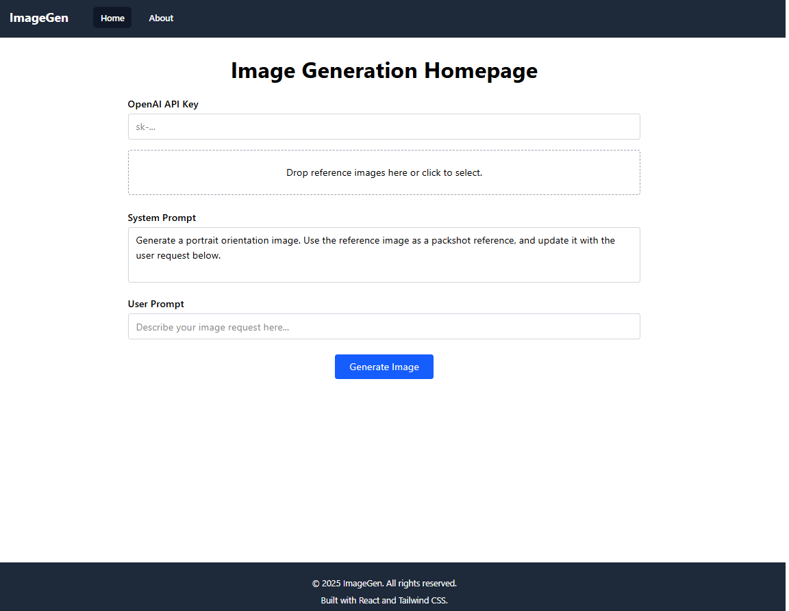

# Image Generation App



Welcome to our Image Generation App! This project uses OpenAI’s **`gpt-image-1`**, the most advanced and natively multimodal model for image creation and editing.

## ✨ Powered by GPT-Image-1

`gpt-image-1` is OpenAI’s state-of-the-art model that combines the power of image and text understanding. It supports:

- 🎨 **High-Fidelity Image Generation**  
  Generate detailed, realistic, or artistic images from natural language prompts.

- 🖌️ **Image Editing**  
  Modify existing images with textual instructions—add, remove, or change visual elements precisely.

- 🧠 **Multimodal Understanding**  
  Native support for both images and text, enabling context-aware generation and smarter edits.

- 🖼️ **Reference-Guided Generation**  
  Upload sample images to maintain visual consistency in characters, styles, or layouts.

- 🪄 **Transparent Background Support**  
  Useful for assets, icons, UI design, and compositing tasks.

- ⚡ **Fast and Scalable**  
  Optimized for production use in content creation, ideation, and design workflows.

## 🚀 Getting Started

To generate or edit images:

1. Write a prompt describing what you want.
2. (Optional) Upload reference images or visuals to modify.
3. Let `gpt-image-1` do the magic.

Example prompt:
```

A futuristic city skyline at sunset, in the style of Blade Runner.

````

## 📁 Project Structure

```bash
imagen_app/
├── public/
│   └── homepage_screenshot.png
├── src/
│   └── ...
├── README.md
````

## 📄 License

MIT License

---

Made with ❤️ and powered by OpenAI’s `gpt-image-1`.